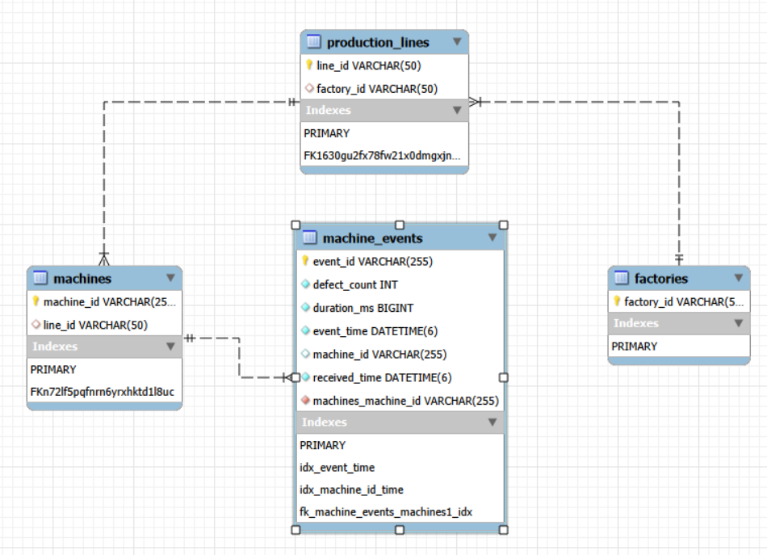

# Architecture & System Design

## 1. System Overview

The **Sensor Event Service** is a high-throughput backend designed to ingest manufacturing sensor data and provide real-time production analytics. The system handles **bursty traffic** (targeting **1,000 events/sec**) while ensuring **strict data consistency** and **transactional integrity**.

### Core Technology Stack

* **Application:** Java 21 (Spring Boot 3.x)
* **Database:** MySQL 8.0+ (Leveraging `JSON_TABLE` and Native Stored Procedures)
* **Architecture Style:** Layered Monolith with Database-Centric Batch Processing

---

## 2. Validation Strategy (Open/Closed Principle)

Before ingestion logic begins, incoming payloads must pass strict validation rules. To maintain clean code and adhere to the **Open/Closed Principle (OCP)**, the system utilizes the **Strategy Design Pattern**.

### The Pattern Implementation

Instead of a monolithic `validate()` method filled with `if-else` statements, validations are decoupled into small, single-responsibility classes implementing a common interface.

* **Interface:** `EventValidationStrategy`
* **Method:** `Optional<String> validate(EventRequestDTO event)`

### Concrete Strategies

* **FutureEventStrategy**
  Rejects events with `eventTime > 15 minutes` in the future. This protects the system from clock skew issues on client machines.

* **InvalidDurationStrategy**
  Rejects events with `durationMs < 0` or `> 6 hours`. This ensures sanity checks on physical sensor data.

### OCP in Action

This architecture allows the system to be **Open for Extension but Closed for Modification**.

**Scenario:** A new requirement emerges to reject events with negative `machine_id`s.

**Solution:** Create a new class `MachineIdValidationStrategy` implementing the interface.

**Result:** The core `EventIngestService` remains untouched. Spring automatically injects the new strategy into the validation list, instantly enabling the rule.

---

## 3. Ingestion Architecture & Evolution

The ingestion layer is responsible for **persistence**, **deduplication**, and **update handling**. It has evolved to solve edge cases around **Net-Zero Transactions** that standard bulk inserts cannot handle.

### Phase 1: V1 Strategy (Edge cases & assumptions)

* **Endpoint:** `POST /ingest`
* **Approach:** *Pre-Process & Compact*

**Logic:**
The service compacted the batch in-memory before persisting. If a batch contained:

* `{ID:1, Val:A}`
* `{ID:1, Val:B}`

Only `{ID:1, Val:B}` would be sent to the database.

#### Limitation: Net-Zero Transaction

**Scenario:**

* Database already has `{ID:1, Val:A}`
* Incoming batch: `{ID:1, Val:B}` → `{ID:1, Val:A}`

**Outcome:**

* In-memory compaction produces `{ID:1, Val:A}`
* Database sees no change → marks as duplicate

**Failure:** Transition history is lost. Update count should be `+2`, but metrics record `1` updated `1` deduped.

---

### Phase 2: V2 Strategy (Current Production)

* **Endpoint:** `POST /v2/ingest`
* **Approach:** *Split-Path Hybrid Strategy*

#### Step A: Batch Splitting

The batch is split based on **key collisions**:

* **Fast Stream (Unique Keys):** Events with unique IDs in the batch
* **Slow Stream (Collisions):** Events where the same ID appears multiple times

#### Step B: Database Execution (Performance strategy)

All logic is offloaded to MySQL Stored Procedures to reduce network I/O.

##### 1. Fast Path – `process_event_batch`

* **Technology:** `JSON_TABLE`
* **Operation:** Set-based `INSERT ... ON DUPLICATE KEY UPDATE`
* **Performance:** Extremely fast (bulk operation)

##### 2. Slow Path – `process_batch_sequential`

* **Technology:** MySQL `CURSOR`
* **Operation:** Row-by-row iteration
* **Reason:** Preserves exact update order (A → B → A), ensuring accurate counters

#### Step C: Filtering Decision Matrix

| Condition                       | Action       | Metric Effect |
| ------------------------------- | ------------ | ------------- |
| New Event ID                    | Insert Row   | Accepted +1   |
| Existing ID + Same Payload      | Ignore Write | Deduped +1    |
| Existing ID + Different Payload | Update Row   | Updated +1    |

**Same Payload Comparison Fields:**

* `machine_id`
* `duration_ms`
* `defect_count`
* `event_time`

If these match, the event is a duplicate. If they differ, `received_time` enforces **Last-Write-Wins** semantics.

## Deduplication & Update Logic

The system enforces data consistency using a **Backend-Authoritative Last-Write-Wins** strategy. High-frequency sensor networks often resend duplicate packets or corrected values, so the database must decide whether to ignore or overwrite an existing record.

---

### 1. Comparison Strategy

When an incoming event references an existing `event_id`, the stored procedure performs a **field-by-field comparison** between the incoming payload and the stored row.

The payload is defined by four business-critical fields:

- `machine_id` – machine reassignment check
- `duration_ms` – duration correction check
- `defect_count` – defect update check
- `event_time` – sensor timestamp adjustment

---

### 2. Winning Record Decision

#### Case A: Exact Match (Deduplication)

All four fields match the stored record.

- **Action:** Write ignored (no data change)
- **Timestamp:** Original `received_time` preserved
- **Metric:** `deduped` counter incremented

---

#### Case B: Field Mismatch (Update)

Any of the four fields differ.

- **Action:** Existing row updated
- **Timestamp:** `received_time` overwritten (Last-Write-Wins)
- **Metric:** `updated` counter incremented

### Logic Flowchart


---

## 4. Analytics & Reporting Features

The system exposes two analytical perspectives:

* **Operational Health (Machine-focused)**
* **Strategic Quality (Production Line-focused)**

### Feature A: Machine Health Monitor (`/stats`)

**Question Answered:** *Is this machine behaving normally right now?*

* **Scope:** Single machine, user-defined time window

#### Heartbeat Logic

* `defect_count = -1` indicates a system heartbeat
* Counts toward **eventsCount**
* Does NOT count toward **defectsCount**

#### Metric: Average Defect Rate

```
Defect Rate = Total Defects / Window Duration (hours)
```

#### Status Determination

* 🟢 **Healthy:** Rate < 2.0
* 🔴 **Warning:** Rate ≥ 2.0

---

### Feature B: Top Defect Lines (`/stats/top-defect-lines`)

**Question Answered:** *Which production line produces the most waste relative to output?*

* **Scope:** Entire factory
* **Aggregation Level:** Production Line

#### Aggregation Hierarchy

```
Factories → ProductionLines → Machines → MachineEvents
```

#### Metric: Defect Percentage

```
Defect % = (Total Defects × 100.0) / Total Events
```

This normalizes performance across different production volumes.

* **Sorting:** Descending (worst-performing lines first)

---

## 5. Data model

> **Note:** Schema includes indexes optimized for time-window lookups and join performance.

###### 

### Stored Procedures
#### Fast Stored Procedure
    DROP PROCEDURE IF EXISTS process_event_batch;;
    
    CREATE PROCEDURE process_event_batch(IN jsonBatch JSON)
    BEGIN
    SET SESSION TRANSACTION ISOLATION LEVEL READ COMMITTED;
    CREATE TEMPORARY TABLE IF NOT EXISTS staging_events (
    event_id VARCHAR(50) PRIMARY KEY,
    machine_id VARCHAR(50),
    event_time DATETIME(6),
    received_time DATETIME(6),
    duration_ms BIGINT,
    defect_count INT
    );
        TRUNCATE TABLE staging_events;
    
        INSERT INTO staging_events (event_id, machine_id, event_time, received_time, duration_ms, defect_count)
        SELECT
            jt.event_id,
            jt.machine_id,
            CAST(REPLACE(jt.event_time, 'Z', '') AS DATETIME(6)),
            CAST(REPLACE(jt.received_time, 'Z', '') AS DATETIME(6)),
            jt.duration_ms,
            jt.defect_count
        FROM JSON_TABLE(jsonBatch, '$[*]' COLUMNS (
            event_id VARCHAR(50) PATH '$.event_id',
            machine_id VARCHAR(50) PATH '$.machine_id',
            event_time VARCHAR(50) PATH '$.event_time',
            received_time VARCHAR(50) PATH '$.received_time',
            duration_ms BIGINT PATH '$.duration_ms',
            defect_count INT PATH '$.defect_count'
        )) AS jt
        ON DUPLICATE KEY UPDATE
            machine_id = VALUES(machine_id),
            event_time = VALUES(event_time),
            received_time = VALUES(received_time),
            duration_ms = VALUES(duration_ms),
            defect_count = VALUES(defect_count);
    
        SELECT
            CASE
                WHEN t.event_id IS NULL THEN 'ACCEPTED'
                WHEN (
                    t.machine_id = s.machine_id AND
                    t.event_time = s.event_time AND
                    t.duration_ms = s.duration_ms AND
                    t.defect_count = s.defect_count
                ) THEN 'DEDUPED'
                ELSE 'UPDATED'
            END AS status,
            COUNT(*) AS count
        FROM staging_events s
        LEFT JOIN machine_events t ON s.event_id = t.event_id
        GROUP BY status;
    
        INSERT INTO machine_events (event_id, machine_id, event_time, received_time, duration_ms, defect_count)
        SELECT event_id, machine_id, event_time, received_time, duration_ms, defect_count
        FROM staging_events
        ON DUPLICATE KEY UPDATE
            machine_id = VALUES(machine_id),
            event_time = VALUES(event_time),
            received_time = VALUES(received_time),
            duration_ms = VALUES(duration_ms),
            defect_count = VALUES(defect_count);
    
        DROP TEMPORARY TABLE IF EXISTS staging_events;
        SET SESSION TRANSACTION ISOLATION LEVEL REPEATABLE READ;
    END;;

#### Sequential Stored Procedure
    DROP PROCEDURE IF EXISTS process_batch_sequential;;
    
    CREATE PROCEDURE process_batch_sequential(IN jsonBatch JSON)
    BEGIN
    DECLARE done INT DEFAULT FALSE;
    DECLARE v_event_id VARCHAR(50);
    DECLARE v_machine_id VARCHAR(50);
    DECLARE v_event_time DATETIME(6);
    DECLARE v_received_time DATETIME(6);
    DECLARE v_duration_ms BIGINT;
    DECLARE v_defect_count INT;
    
        DECLARE v_accepted INT DEFAULT 0;
        DECLARE v_updated INT DEFAULT 0;
        DECLARE v_deduped INT DEFAULT 0;
    
        DECLARE db_machine_id VARCHAR(50);
        DECLARE db_duration_ms BIGINT;
        DECLARE db_event_time DATETIME(6);
        DECLARE db_defect_count INT;
        DECLARE row_exists INT;
    
        DECLARE event_cursor CURSOR FOR
        SELECT
            event_id, machine_id,
            CAST(REPLACE(event_time, 'Z', '') AS DATETIME(6)),
            CAST(REPLACE(received_time, 'Z', '') AS DATETIME(6)),
            duration_ms, defect_count
        FROM JSON_TABLE(jsonBatch, '$[*]' COLUMNS (
            event_id VARCHAR(50) PATH '$.event_id',
            machine_id VARCHAR(50) PATH '$.machine_id',
            event_time VARCHAR(50) PATH '$.event_time',
            received_time VARCHAR(50) PATH '$.received_time',
            duration_ms BIGINT PATH '$.duration_ms',
            defect_count INT PATH '$.defect_count'
        )) AS jt;
    
        DECLARE CONTINUE HANDLER FOR NOT FOUND SET done = TRUE;
        SET SESSION TRANSACTION ISOLATION LEVEL READ COMMITTED;
        OPEN event_cursor;
    
        read_loop: LOOP
            FETCH event_cursor INTO v_event_id, v_machine_id, v_event_time, v_received_time, v_duration_ms, v_defect_count;
            IF done THEN
                LEAVE read_loop;
            END IF;
    
            SELECT count(*), MAX(machine_id), MAX(duration_ms), MAX(defect_count), MAX(event_time)
            INTO row_exists, db_machine_id, db_duration_ms, db_defect_count, db_event_time
            FROM machine_events
            WHERE event_id = v_event_id;
    
            IF row_exists = 0 THEN
                INSERT INTO machine_events (event_id, machine_id, event_time, received_time, duration_ms, defect_count)
                VALUES (v_event_id, v_machine_id, v_event_time, v_received_time, v_duration_ms, v_defect_count);
                SET v_accepted = v_accepted + 1;
            ELSE
                IF (v_machine_id = db_machine_id AND v_duration_ms = db_duration_ms AND v_defect_count = db_defect_count AND v_event_time = db_event_time) THEN
                    SET v_deduped = v_deduped + 1;
                ELSE
                    UPDATE machine_events
                    SET machine_id = v_machine_id,
                        event_time = v_event_time,
                        received_time = v_received_time,
                        duration_ms = v_duration_ms,
                        defect_count = v_defect_count
                    WHERE event_id = v_event_id;
                    SET v_updated = v_updated + 1;
                END IF;
            END IF;
        END LOOP;
    
        CLOSE event_cursor;
    
        SELECT 'ACCEPTED' as status, v_accepted as count
        UNION ALL
        SELECT 'UPDATED' as status, v_updated as count
        UNION ALL
        SELECT 'DEDUPED' as status, v_deduped as count;
        SET SESSION TRANSACTION ISOLATION LEVEL REPEATABLE READ;
    END;;

## 6. Concurrency & Thread-safety

The system is designed for high concurrency without application-level locking.

### Thread-Per-Request Model

* Spring Boot (embedded Tomcat) uses a **thread-per-request** model
* Each HTTP request is handled by a separate thread
* Supports parallel ingestion and horizontal scalability

### Stateless Service

* The application holds **no in-memory state**
* All state is persisted and synchronized via the database

### Database Isolation

* **Isolation Level:** `READ COMMITTED`
* **Concurrency Control:** MySQL row-level locking

If two requests update the same `Event-ID` concurrently, MySQL serializes them internally, ensuring **ACID compliance** without complex Java-side synchronization.

## Setup & Run Instructions

---

### 1. Prerequisites

Before running the application, ensure your environment meets the following requirements:

- **Java 21 JDK**  
  Verify with: `java -version`

- **Maven 3.8+**  
  Verify with: `mvn -version`

- **MySQL 8.0+**  
  Verify with: `mysql --version`

- **Git** (to clone the repository)

---

### 2. Database Setup

The application requires two separate databases:
- One for the main application
- One for integration tests

#### Step 2.1: Create Databases

Open your MySQL terminal or Workbench and execute:

```sql
    -- Main Database
    CREATE DATABASE IF NOT EXISTS factory_db;
    
    -- Test Database (Mandatory for `mvn test`)
    CREATE DATABASE IF NOT EXISTS factory_test_db;
```
#### Step 2.2: User Permissions
    
Ensure your database user has permissions to create tables and execute stored procedures:

```sql
    GRANT ALL PRIVILEGES ON factory_db.* TO 'root'@'localhost';
    GRANT ALL PRIVILEGES ON factory_test_db.* TO 'root'@'localhost';
    FLUSH PRIVILEGES;
```
> **Note:**  
> Schema (tables + stored procedures) is automatically initialized on startup using `schema.sql`.

---

### 3. Application Configuration

#### Main Configuration

Edit `src/main/resources/application.properties`:

```properties
spring.datasource.url=jdbc:mysql://localhost:3306/factory_db?allowPublicKeyRetrieval=true&useSSL=false&serverTimezone=UTC
spring.datasource.username=YOUR_MYSQL_USERNAME
spring.datasource.password=YOUR_MYSQL_PASSWORD

spring.jpa.hibernate.ddl-auto=none
spring.sql.init.mode=always
```
#### Test Configuration

Edit `src/test/resources/application-test.properties`:

```properties
spring.datasource.url=jdbc:mysql://localhost:3306/factory_test_db?allowPublicKeyRetrieval=true&useSSL=false&serverTimezone=UTC
spring.datasource.username=YOUR_MYSQL_USERNAME
spring.datasource.password=YOUR_MYSQL_PASSWORD
```
### 4. Building the Project

```bash
mvn clean package
**Success Indicators:**
- `BUILD SUCCESS`
- All tests pass
```
**Output:**
- Executable JAR generated in the `target/` directory

---

### 5. Running the Application

```bash
java -jar target/sensor-event-service-0.0.1-SNAPSHOT.jar
```
Or:

```bash
mvn spring-boot:run
```
Application runs on port 8080.

---

### 6. Verification Steps

```bash
curl -X GET "http://localhost:8080/stats?machineId=M-TEST&start=2024-01-01T00:00:00Z&end=2024-01-02T00:00:00Z"
```
**Expected Response:**
```
{
  "machineId": "M-TEST",
  "eventsCount": 0,
  "defectsCount": 0,
  "avgDefectRate": 0.0,
  "status": "Healthy"
}
```


## Future Improvements

If given more time to work on this project, I would implement the following architectural changes to enhance **scalability**, **performance**, and **resilience**.

---

### 1. Hash-Based Deduplication Strategy

**Current Limitation:**
- The "Winning Record" logic requires a field-by-field comparison (`machine_id`, `duration_ms`, `defect_count`, etc.) inside the Stored Procedure.

**Scalability Issue:**
- As the event schema grows (e.g., adding `temperature`, `pressure`, `operator_id`), the SQL comparison logic becomes more complex and computationally expensive.

**Maintenance:**
- Every schema change requires updating the Stored Procedure logic.

**Proposed Solution:**
- Introduce a **Payload Hash (Checksum)** mechanism.

**Logic:**
- Upon receiving an event, the Application Layer calculates a deterministic hash (e.g., SHA-256) of the business-critical fields.

**Storage:**
- Store this hash in a new indexed column: `event_hash`.

**Comparison:**
- Deduplication simplifies to checking:
  ```sql
  IF db_event_hash = new_event_hash
  ```
### Benefit

- Constant-time \(O(1)\) comparison regardless of the number of fields in the payload, significantly improving write performance for large schemas.

---

## 2. Asynchronous Queue-Based Ingestion

**Current Limitation:**
- The current architecture is synchronous. HTTP threads block while waiting for the Stored Procedure to finish.

**Bottleneck:**
- Under extreme load (e.g., >10,000 events/sec), Tomcat threads can be exhausted if the database slows down, causing API rejections.

**Failure Risk:**
- If the service crashes mid-processing, in-memory batches could be lost.

**Proposed Solution:**
- Move to an **Asynchronous Event-Driven Architecture**.

**Implementation:**

- **Ingestion API:**
    - Receives the batch, validates it, and immediately pushes it to a **Message Queue** (e.g., Kafka or RabbitMQ).
    - Returns `202 Accepted` instantly.

- **Worker Service:**
    - A separate consumer reads from the queue, accumulates efficient batches, and writes to the database.

- **Request Tracking:**
    - Implement a `batch_id` tracker (stored in Redis) so clients can poll the status of their async upload:
      ```
      GET /ingest/status/{batchId}
      ```

- **Real-time Notifications:**
    - Instead of polling, use **Webhooks** or **Server-Sent Events (SSE)** to notify clients when ingestion completes or errors occur.

**Benefits:**

- **Backpressure Handling:** Queue buffers spikes in traffic.
- **Resilience:** Messages persist in the queue if the database goes down, ensuring no data loss.
- **Decoupling:** Scaling the stateless Ingestion API is independent of the DB Writer workers.
